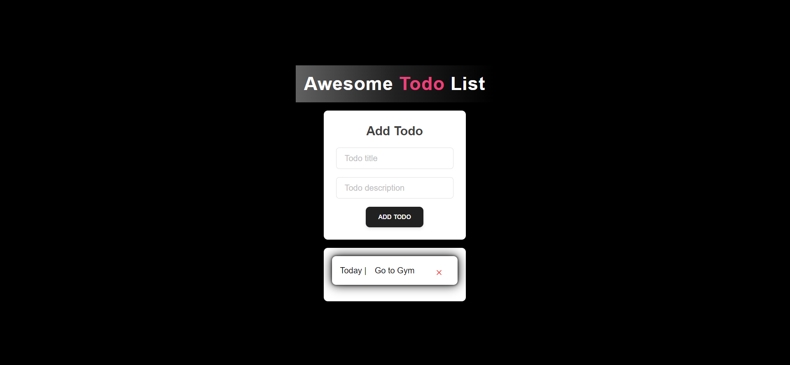

# Express MongoDB , ReactTodo App


This is a simple Express.js application that interacts with a MongoDB database to manage todos. It includes routes to get all todos, get a specific todo by ID, create a new todo, and delete a todo.

## Prerequisites

Before running the application, make sure you have the following installed:

- Node.js
- npm (Node Package Manager)
- MongoDB Atlas URI (Replace the URI in the code with your own)
- React js for Frontend
- Also used Tailwind

## Installation

1. Clone the repository:

   ```bash
   git clone <repository-url>
   ```

2. Install dependencies:

   ```bash
   npm install
   ```

3. Replace the MongoDB Atlas URI in the code:

   Replace the URI in the `mongoose.connect()` function call with your own MongoDB Atlas URI.

## Usage

1. Start the application:

   ```bash
   node app.js
   ```

2. Access the application in your web browser or use tools like Postman to interact with the API endpoints.

## Endpoints

- `GET /todos`: Get a list of all todos.
- `GET /todos/:id`: Get a specific todo by ID.
- `POST /todos`: Create a new todo.
- `DELETE /todos/:id`: Delete a todo by ID.

## Folder Structure

The project has the following folder structure:

- `public/`: Contains static files (if any).
- `app.js`: Main application file containing the Express.js server code.
- `package.json`: Lists project dependencies and configuration.
- `package-lock.json`: Auto-generated file for npm package version locking.

## Contributing

Feel free to contribute to this project by submitting pull requests or reporting issues.

## License

```
## Also Removed Config.env file for security reasons create your own env file
Make sure to replace `<repository-url>` with the actual URL of the repository if applicable. Also, update the MongoDB Atlas URI in the `mongoose.connect()` function call with your own URI.
```
